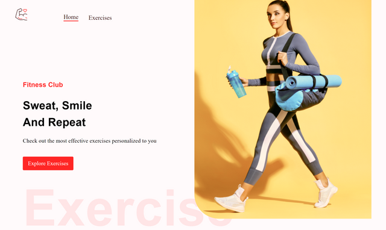

- Advanced React Best Practices such as file structure and hooks
- Creating a Beautiful User Interface using the Material UI (version 5)
- Fetching data from unlimited sources using RapidAPI

### `npm start`

Runs the app in the development mode.\
Open [http://localhost:3000](http://localhost:3000) to view it in your browser.

The page will reload when you make changes.\
You may also see any lint errors in the console.

